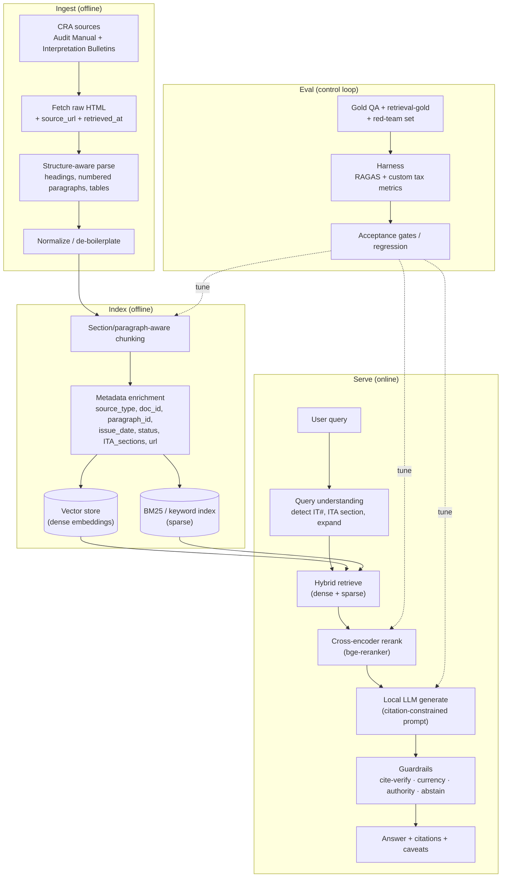

# 02 — End-to-end design

Three planes: **Ingest/Index** (offline), **Serve** (online), **Eval** (control loop).

## Component choices (local-first, all on-prem)

| Stage | Recommended OSS | Notes |
|---|---|---|
| Fetch | `httpx` + `trafilatura`/`readability` | Save raw HTML; record `source_url`, `retrieved_at`. |
| Parse | `selectolax`/`lxml` + custom | **Preserve numbered paragraphs** — they're citation anchors. |
| Chunk | custom section/paragraph splitter | Hierarchical; keep parent-section context. |
| Embed | `bge-large-en` / `gte-large` / `nomic-embed` | Local; quality-sensitive — keep full precision. |
| Vector DB | Qdrant / pgvector / LanceDB / Chroma | Needs **metadata filtering** (status, ITA section). |
| Sparse | BM25 (Elasticsearch/OpenSearch, or `rank_bm25`) | Tax queries are citation/term heavy → hybrid wins. |
| Rerank | `bge-reranker-large` (cross-encoder) | Biggest precision lever after hybrid retrieval. |
| Generate | Llama-3.x / Qwen2.5 / Mistral via **vLLM**/Ollama/llama.cpp/TGI | Quantize (AWQ/GPTQ/GGUF) to fit VRAM. |
| Orchestration | LlamaIndex or LangChain, or thin custom | Thin custom keeps guardrails explicit. |
| Eval | RAGAS + DeepEval/TruLens + custom harness | See `04-evaluation.md`. |

## The serving prompt contract (non-negotiable rules)

The generator runs under a system contract that enforces tax-safe behavior:

1. **Answer only from retrieved context.** If the context doesn't support an answer,
   say so and stop. Do not use parametric/memorized tax knowledge as authority.
2. **Cite every substantive claim** — `IT-xxx, para N` or `Audit Manual §X.Y`.
3. **State effective date / status.** If the supporting source is **archived/superseded**,
   say so and point to the superseding Folio if known.
4. **Frame authority correctly.** ITs/Folios are **CRA's administrative position**, not
   law; the Audit Manual is procedure. Never present either as binding statute.
5. **Abstain when appropriate.** Out-of-scope (e.g., GST/HST, provincial-only, US tax),
   insufficient context, or genuinely ambiguous facts → ask to clarify or decline.
6. **Always close with the standing caveat:** decision-support, verify against the ITA,
   current Folios, and a qualified professional.

## Post-generation guardrails (deterministic, outside the LLM)

- **Citation verification:** every citation in the answer must map to a chunk that was
  actually retrieved. Drop/flag any citation that doesn't → blocks fabricated cites.
- **Currency check:** if all supporting chunks are `archived`/`superseded`, force-attach
  a currency warning.
- **Authority check / disclaimer injection:** ensure the standing caveat is present.
- **Abstention calibration:** if reranker top score < threshold, prefer "insufficient
  information" over a low-confidence answer.

These run as code, not as model "please remember to" instructions — that's what makes
them reliable.

## Why hybrid + rerank (and not just vector search)

Tax queries mix **exact tokens** ("subsection 20(1)(c)", "IT-518R", "reasonable
expectation of profit") with **semantic** intent. Dense-only retrieval misses exact
citations; sparse-only misses paraphrase. Hybrid retrieval union + a cross-encoder
reranker that reads (query, chunk) jointly is the highest-ROI retrieval configuration and
directly improves the downstream faithfulness metrics in `04-evaluation.md`.
